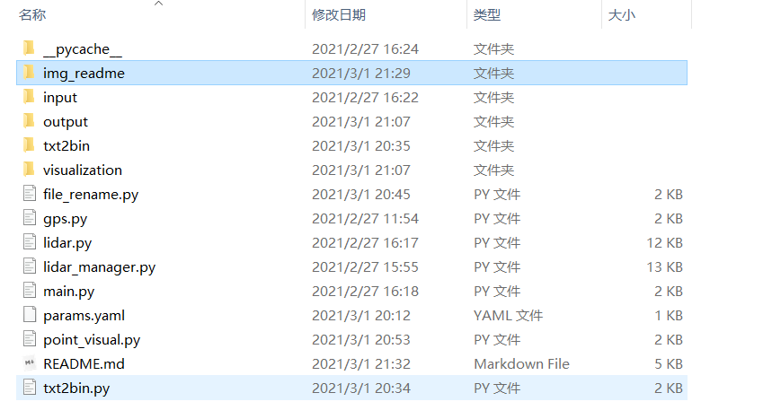
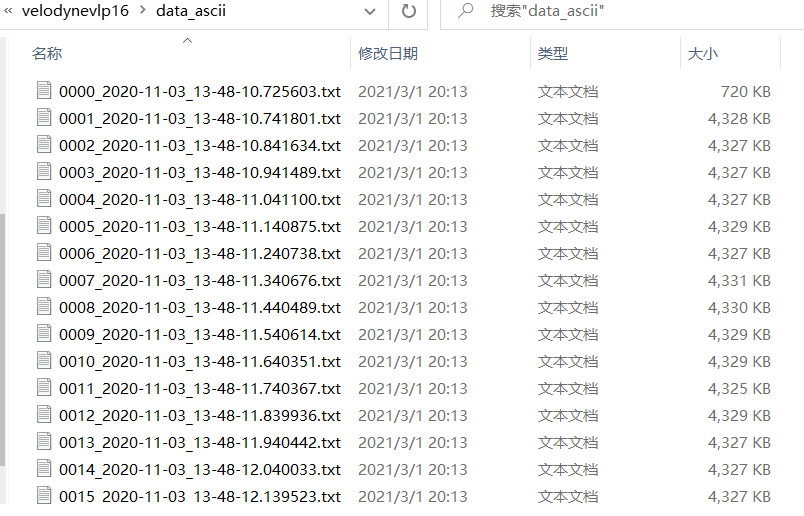
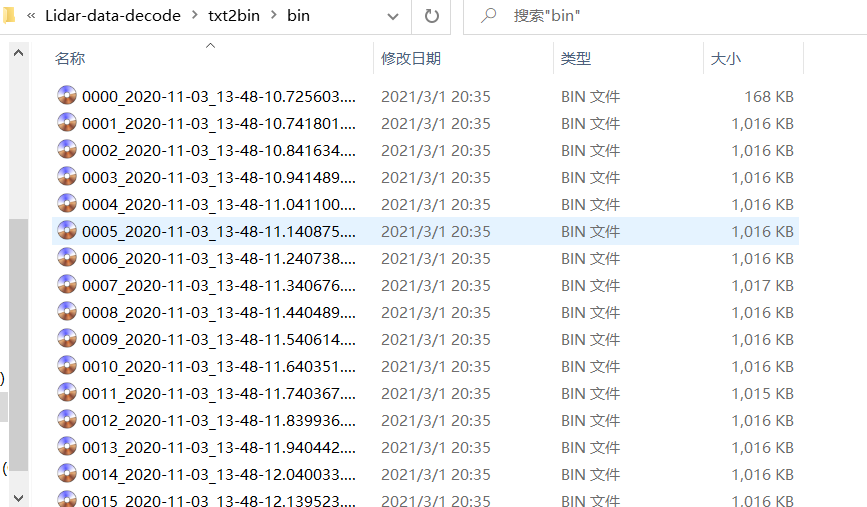
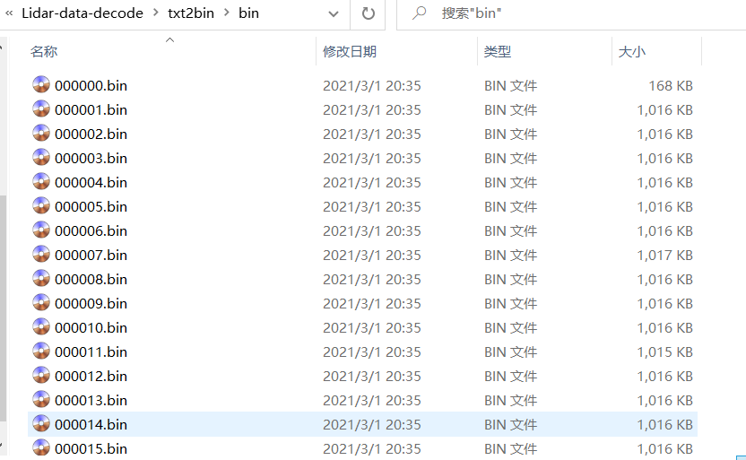
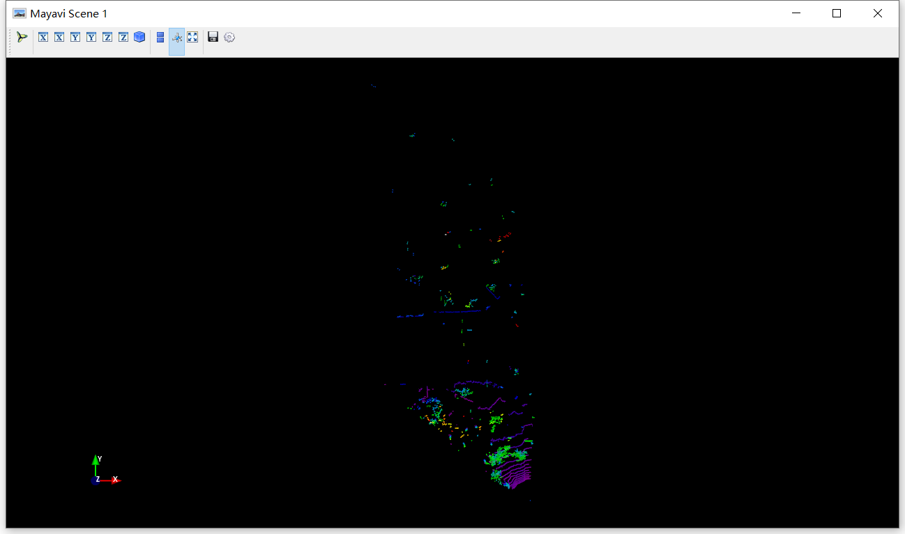
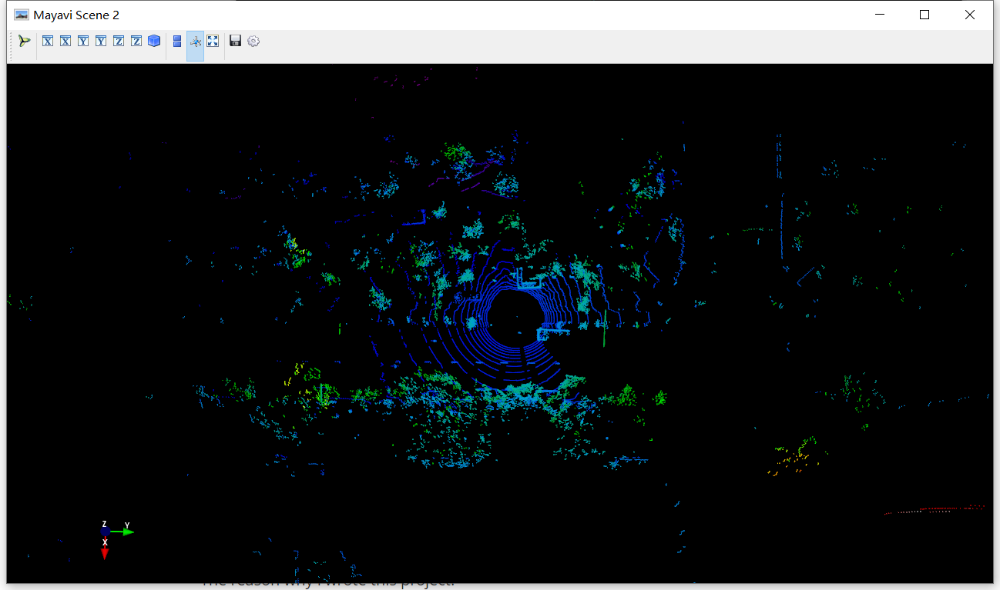

### Lidar-data-decode and dataset preparing
In this project, you can decode your lidar data frame(pcap file) and make your own datasets in Windows without any huge c++-based lib or ROS under Ubuntu
1. in lidar data frame decode part:
- Supports just LSC32(LeiShen Intelligent System) at the moment(you can also change the parameters to fit other lidars like velodyne, robosense...).
- Takes a pcap file recorded by LSC32 lidar as input.
- Extracts all Frames from the pcap file.
- Saves data-frames:
    Data frames are saved as Pointcloud files (.pcd) and/or as Text files(.txt) 
- Can be parameterizes by yaml file.

2. in dataset prepare part:
- Files format conversion(txt to bin, if you want to make your datasets like KITTI format)
- Files rename
- Data frames visualization

##### Output
Below a sample out of 2 Points in a __point cloud file__

All __Point Cloud__ Text-Files have follwoing fields:
Time [musec], X [m], Y [m], Z [m], ID, Intensity, Latitude [Deg], Longitudes [Deg], Distance [m]
2795827803, 0.032293, 5.781942, -1.549291, 0, 6, 0.320, -15.000, 5.986

All __Point Cloud__ PCD-Files have follwoing fields:
1) X-Coordinate
2) Y-Coordinate
3) Z-Coordinate
4) Intensity

##### Dependencies
1. for lidar frame decode:
Veloparser has follwoing package dependencies:
- dpkt
- numpy
- tqdm

2. for lidar frame Visualization:
- mayavi
- torch
- opencv-python  (using pip install opencv-python)

##### Run
Firstly, clone this project by:
"git clone https://github.com/hitxing/Lidar-data-decode.git"

Because empty folders can not be upload on Github, after you clone this project, please create some empty folders as follows:

a. for lidar frame decode:
1. make sure test.pcap is in dir .\input\test.pcap
2. check your parameters in params.yaml, then, run: 
    "python main.py --path=.\input\test.pcap  --out-dir=.\output  --config=.\params.yaml"

after this operation, you can get your Text files/PCD files as follows:

​	1)Text files in .\output\velodynevlp16\data_ascii:

​	2)PCD files in .\output\velodynevlp16\data_pcl:

b. for Format conversion and rename:

If you want to make your datasets like KITTI format(bin files), you should convert your txt files to bin files at first, if you want to make a datset like nuscenes(pcd files), just go to next step and ignore that.

1. put all your txt files to dir .\txt2bin\txt and run  ''python  txt2bin.py"

then, your txt files will convert to bin format and saved in dir ./txt2bin/bin like this:

2. To make a test dataset like KITTI format, the next step is to rename your files like 000000.bin, for bin files(also fits for pcd files, change the parameters in file_rename.py, line 31), run "python file_rename.py", you can get your test dataset in the dir .\txt2bin\bin like this:

   

c. for visualization your data frames(just for bin files now)

Please make sure that all of those packages are installed (pip or conda).

1.  copy your bin files in dir .\txt2bin\bin to your own dir(default is in .\visualization)

2. run "python  point_visul.py", the visual will like this:

   

Note that lidar data in 000000.bin is not complete(data frame after 000000.bin is complete), that why the visualization result is as above, you can delect this frame when you make your own test dataset .000001.bin will like this:

##### About dataset labeling

If you want to make your full dataset(include labeling your data frame), I hope here will be helpful(https://github.com/Gltina/ACP-3Detection).

##### Note

Thanks ArashJavan a lot for provide this fantastic project! lidar data frame decode part in Lidar-data-decode is based on https://github.com/ArashJavan/veloparser which Supports Velodyne VLP16, At this moment, Lidar-data-decode supports LSC32-151A andLSC32-151C, actually, this project can support any lidar as long as you change the parameters follow the corresponding technical manual.

The reason why I wrote this project:\
 a. I could not find any simple way without installing ROS (Robot operating software) or other huge c++-based lib that does 'just' extract the point clouds from pcap-file.\
 b. Provide a reference to expand this project to fit your own lidar and make your own datasets

